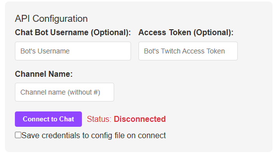
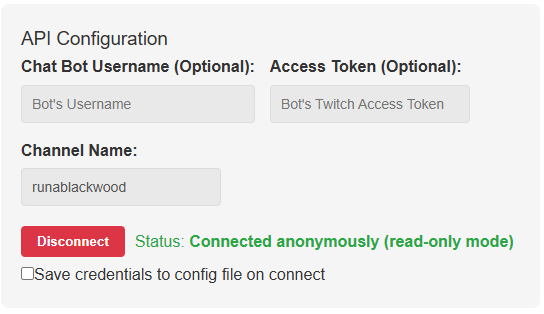

# RunaQueue v1.1.0

## About

RunaQueue is a tool for managing viewers on twitch streams who wish to join the game the streamer is playing.

### Features

- Twitch chat interation
  - join, leave, and check position in queue
- Customize messages that are sent to chat on different actions
- Variably transparent popout window that can be added to OBS as an overly to show queue on stream
- Track and display a viewer's time in the queue
- Flag a viewer in the queue as actively playing
  - Can track the time they've been active
- View and reorder the queue
- Allow users to include a message on join
  - Can require or leave optional
  - Can choose to display message in overly

## Install

There are two options for installing and using RunaQueue:

### Run and install the electron app

1. Download the latest runaqueuetool-version-setup.exe file from the [releases page](https://github.com/HedgehogRidingAnOwl/RunaQueue-Tool/releases).
2. Run the executable to complete the installation.
3. The RunaQueue tool should start automatically after install. After, anytime you wish to run it you can search for and run `runaqueuetool` from the start menu.

### Run as in portable mode

1. Download the latest runaqueue_version_portable.zip file from the [releases page](https://github.com/HedgehogRidingAnOwl/RunaQueue-Tool/releases).
2. Exract the contents of the file to a new folder.
3. Run `runaqueuetool.exe`.

### Optional Bot Configuration Info

If you want the tool to be able to post in chat (i.e. to inform a user they were sucessfully added or that there was an error with them joining) you will need to provide the tool with an access token for an account that can post in chat. This is optional but recommended.

You can generate an access token using [twitchtokengenerator.com](twitchtokengenerator.com).

1. Select "Bot Chat Token".
    - You will be redirected to a Twitch login page. Ensure the one shown is the one you'd like to have sending automated messages in chat. If so, select "Authorize".
2. Three token should become visible and appear as random text. Copy the value for the "Access Token", you will need this once you run RunaQueue.

## Use

### Initial Config

Fill in the values from the API Configuration section and click "Connect to Chat".



#### Optional values

- **Chat Bot Username**: The twitch account name of the account you want to post messages in chat (typically a bot account)

- **Access Token**: The acess token for the chat bot account. Instructions for generating are [above](#optional-bot-configuration-info) and at the top of the window in the RunaQueue tool.

#### Required value

- **Channel Name**: Name of the twitch channel that will be using the queue (whose chat the viewers will be interacting with)

You may optionally choose to save credentials to a config file. This is recommended for convenience but not necessary for any funtionality.

One connected the status should change to "Connected". If bot username and token aren't provided the status will be "Connected anonymously". In this state the queue will work but no status messages will be sent in stream chat.



## Queue Management

The Queue Management section contains all the tools and features use for interacting with the viewer queue.


- **Open/Close Queue**: Sets whether new viewers are able to join the queue
- **Clear Queue**: Removes all current viewers from the queue
- **Require message when joining**: When checked, forces users to include a message in order to join the queue
  - Particularly useful for games that require a username/invite code. This value can be easily copy-pasted.
- **Enable queue popout window**: Spawn a configurable window showing the current users in the queue
  - Configuration for this window is in the [Popout Window Settings](#popout-window-settings) section

---

- **Copy Message**: Copies the message the uesr included (if one was included) to the clipboard
- **Mark/Stop Playing**: Flags a viewer as playing or unflags them if they already are
- **Remove**: Removes the viewer from the queue
- Viewers in the queue can be drag-and-dropped to reorder them

## Advanced Settings

### Queue Settings

- **Max Queue Size**: The maximum number of users that will be allowed to join the queue
- **\* Message**: Change the relevant message that is sent to chat when an action occurs
  - use `{username}` to print the relevant user's username in chat
  - use `{position}` to print the user's current position in the queue

### Popout Window Settings


Settings that only apply to the popout window.

- **Number of users to display**: Changes the number of users from the queue that will be shown
- **Show position numbers**: Displays the viewer's posotion in the queue next to their name
- **Show user messages**: Displays the messag the viewer entered when they joined
- **Show wait times**: Displays the time the viewer has been in the queue
- **Background Opacity**: Adjusts the transparency of the popout window's background

## Other Notes

### Chat Messages Window

The chat messages window shows messages as they appear in the stream chat and has no other functionality. The "Clear Messages" button only clears the window in the RunaQueue tool and has no affect on twitch's stream chat.


## Project Setup

**NOTE:** Most users can ignore this section.

### Install and Build

```bash
yarn
```

### Development

```bash
yarn dev
```

### Build

```bash
# For windows
$ yarn build:win

# For macOS
$ yarn build:mac

# For Linux
$ yarn build:linux
```
